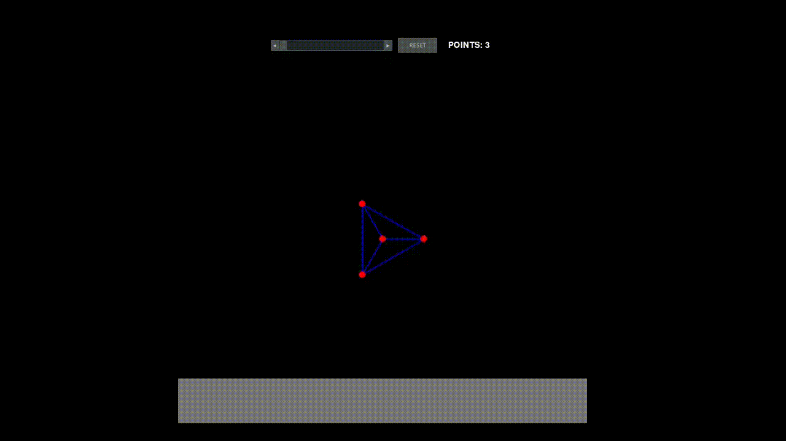
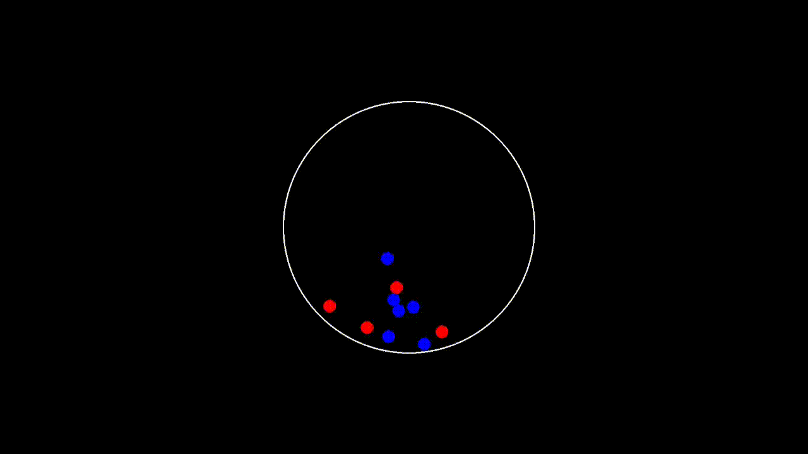

# Programowanie-fizyki  

This project demonstrates 2D physics simulations.

The goal is to build a clear, modular, and stylistically consistent codebase — using `pygame.Vector2`.

 

## Description
- `settings.py` – global constants (window size, gravity, stiffness, etc.)

- `SoftBodyCollision.py`, `VerletCloth.py`, `TikTokBallCollision.py` – simulation scripts

- Uses `pygame` and `pygame.Vector2` for consistent 2D vector math

-------------------------------------
## Physics Calculations
### *Soft Body Simulation*  
 

 

 
 

### *Bouncing Balls in a Circular Arena* 
 

 

 
 

### *Cloth Simulation* 

 

 

-------------------------------------

 
 

## How to Run
1. Clone the repository:

   `git clone https://github.com/MiernikA/Programowanie-fizyki.git`

2. Install requirements:

   `pip install pygame`

3. Run a simulation:
   python SoftBodyCollision.py

4. Adjust parameters in settings.py (e.g. GRAVITY, SPRING_CONSTANT).

